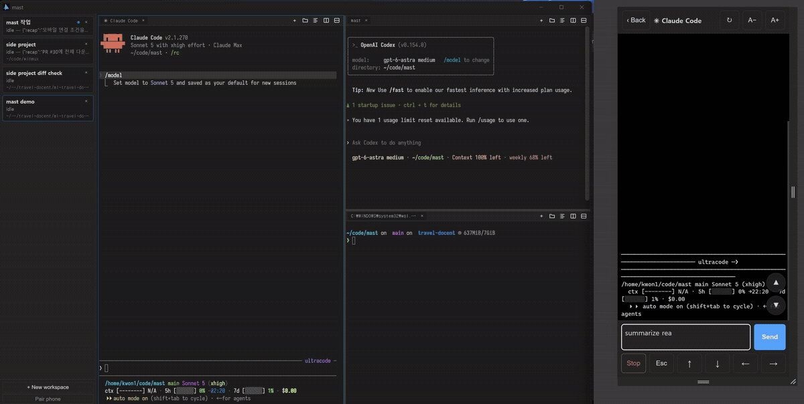

# mast

[](https://github.com/sjkwon-1023/mast/actions/workflows/ci.yml)
[](LICENSE)

**Run several coding agents on Windows + WSL2 and see which one is waiting for you — from your
desk or from your phone.**



Check terminal output and send input from your phone on the same trusted local network as your PC.

## macOS (Apple Silicon, source builds)

The native macOS port shares the same workspace, pane, tab and terminal core as Windows.
The source build includes the Git Changes viewer, a startup-only release notice, opt-in Local
HTTP, on-demand Secure Remote pairing, and Antigravity CLI running/idle hooks. See
[the macOS guide](docs/MACOS.md) for prerequisites, configuration, limits and the device
verification checklist. Signed Mac distribution, packaging and automatic binary updates are
not included.

## What it's for

You are running Claude Code, Codex and a couple of shells at once, and each stops to ask you
something at a moment you cannot predict. A plain terminal hides that — the agent waiting for an
answer looks exactly like the one still working, and you find out by cycling through windows.

mast keeps a status card per workspace (running, needs input, done) with the agent's last message,
notifies you when one starts waiting, and lets you answer from your phone even while lying in bed.

## Why mast

- **A lightweight agent terminal** — run several coding agents in one Windows + WSL2 workspace
  and see who needs you at a glance, without an IDE runtime.
- **Stay in one tool** — split panes and tabs, plus folder, text and Markdown viewers, without
  opening an IDE.
- **Control your terminals from bed** — pair a phone on the same local network as your PC,
  read output and send input to agent CLIs or ordinary Bash shells.
- **Let agents talk to each other** — agents can use `mast ls` and `mast send` inside their
  terminals to hand work to another pane in the same workspace.
- **Resume with Up** — after restarting mast, press `Up` in a restored Bash pane to recall
  its saved Claude Code or Codex resume command, then `Enter` to continue the conversation.
  This resumes the agent's saved session; the old process does not stay running after exit.
- **Portable** — a single executable. No installer, no setup wizard.
- **Reload any time** — `Ctrl+Shift+R` rebuilds the window; the shells and agents keep running.

Most agent multiplexers are built for macOS and Linux terminals. Mast began as an agent terminal
for Windows + WSL2; an Apple Silicon native source build is also available.

## Features

- **Split panes** — split either way, drag to resize, `Alt+Shift`+arrows to move focus. A new pane or tab
  opens in the directory the pane's shell is in.
- **Tabs inside panes** — every pane has its own tab strip; background tabs stay alive.
- **Agent status and notifications** — Claude Code and Codex report running / needs input / idle
  for each tab, and Antigravity CLI reports running / idle. The sidebar card shows the most urgent
  tab, the waiting tab gets its own badge, and a Windows toast names the tab that starts waiting.
- **Agent-to-agent communication** — `mast ls` discovers tabs and `mast send '#<id>' 'text'`
  sends input to another agent or shell in the same workspace (`-l` pre-fills without submitting).
- **Viewer tabs** — the Windows build has a folder browser, text viewer and Markdown viewer for
  files inside WSL. The pane-header Changes button opens changed files and a selected unified
  diff, with Working / Staged / All scopes. It is read-only, refreshes when reopened or with
  Refresh, and limits each diff to 512 KiB. Git and GNU `timeout` must be installed in that WSL
  distro. The macOS source build runs Git directly; see [the macOS guide](docs/MACOS.md).
- **Phone terminal control (opt-in)** — pair by QR, then read output, scroll a full-screen TUI,
  or send input to an agent CLI or a regular Bash shell. It is not limited to agent prompts.
  *Pair phone* always offers two working modes and a disabled `Tailscale — Planned` entry:
  - **Local HTTP** — the original mode, off by default. Turn it on with the `"remote"` key in
    `settings.json`; it serves plain HTTP on your LAN and the pairing token lives in the phone
    browser's local storage. It is not hardened for public internet exposure — keep it on
    your own network.
  - **Secure Remote** — no setting to enable: the dialog opens a UDP 7331 listener while it
    shows the QR (at most two minutes if it is never scanned). After pairing, one phone can
    connect at a time until the certificate expires (up to 14 days) or mast exits. The phone
    loads a public HTTPS page from GitHub Pages, shows which `host:port` it is opening, and
    connects straight to the PC over WebTransport, pinning the SHA-256 fingerprint of the
    certificate issued for that pairing. After successful authentication, the phone browser
    saves the LAN address, token and certificate fingerprint in its local storage until the
    certificate expires. The page can reconnect after a reload or screen lock while mast keeps
    running. Closing mast ends the pairing and requires a fresh QR. The dialog removes the QR
    and URL once the phone connects or the pairing ends, so a dead QR is never shown as live.
    A browser without WebTransport shows an explicit error; one that ignores the
    certificate-pinning option fails later at TLS with a connection error, never a silent
    fallback to plain HTTP.

  Both QRs carry this PC's **LAN address**, and mast opens no path beyond your own network —
  there is no cloud relay. For the QR to work as generated, your PC and phone must be on the
  same trusted LAN, typically the same home router; mobile data (4G/5G) or an unrelated Wi-Fi
  network reaches the PC only through a separate path you set up yourself — VPN, Tailscale or
  port forwarding — never automatically. Guest Wi-Fi or client isolation can block access even
  on the same router. On Windows, the pairing dialog checks TCP/UDP-specific Windows Firewall
  rules and offers to write the applicable rule behind a UAC prompt. On macOS, it checks an
  app-level macOS Firewall rule shared by Local HTTP and Secure Remote; administrator approval
  is requested only after you click its allow button. See [`docs/SETTINGS.md`](./docs/SETTINGS.md).
- **Layout persistence** — workspaces, splits and tabs come back, each shell respawned where it was,
  and a tab that was running an agent returns with its resume command one `Up` away.
- **Manager workspace (preview, opt-in)** — a pinned workspace whose agent and task board summarize
  Claude Code and Codex work across all workspaces: waiting questions, user/ai decisions with quoted
  evidence, progress, next steps and plan links. Enable with
  `mast config set manager.enabled true` (needs the Codex CLI and a full restart). The manager query
  is read-only, and `mast manager patch` records user decisions and corrections.
  See [ADR-0032](docs/adr/0032-manager-workspace-preview.md).

내장 브라우저 탭은 `◎` 버튼으로 연다. 에이전트는 `mast browser`로 같은 탭의 요소와
스크린샷을 확인하고 입력·클릭할 수 있다. `mast config set browser.enabled false`로
끄고 완전히 재시작하면 추가 브라우저 실행 자원을 만들지 않는다.
[브라우저 사용법과 WSL 시작 안내](./docs/BROWSER.md).

## Install

**요구 사항:** Windows 11 (x64 또는 ARM64)과 WebView2. 터미널과 WSL 파일 뷰어는
Ubuntu 같은 Linux 배포판이 설치된 WSL2가 필요하다. WSL이 준비되지 않았으면 앱에서
설치·초기 설정·재검사를 안내하며, 내장 브라우저는 WSL 없이 사용할 수 있다.

1. **Prepare WSL2.** If needed, run `wsl --install` in administrator PowerShell, restart Windows,
   then open Ubuntu and create your Linux user account.
   [WSL installation guide](https://learn.microsoft.com/en-us/windows/wsl/install).
2. **Prepare your agents.** Install Claude Code, Codex or Antigravity CLI inside WSL before first
   launching mast. On Ubuntu, install the integration helpers with
   `sudo apt install python3 jq coreutils`; Claude Code approval tracking and every Codex hook
   need Python 3.8 or later.
   Agents are optional if you only want Bash terminals.
3. **Download and run.** Get `mast-x64.exe` or `mast-arm64.exe` from the
   [latest release](https://github.com/sjkwon-1023/mast/releases/latest) and run it — no installer.
   If SmartScreen warns, verify the download came from this repository, then choose
   **More info** → **Run anyway**.

mast opens your default WSL distribution and automatically sets up agent integration on first
launch. Anything it could not set up, and what to do about it, is written to `~/.mast/setup.log`.

- **Claude Code** needs nothing more. With Python 3.8+ and Claude Code 2.1.118 or later, a tab
  that asked for approval shows running again as soon as the approved tool finishes.
- **Codex** needs one step from you. mast installs its hooks in `~/.codex/hooks.json` (always
  `~/.codex`; a custom `CODEX_HOME` is not followed), and Codex runs none of them until you trust
  them in the **Hooks need review** prompt at its next launch. Until you do, that prompt returns
  on every Codex launch. To decline for good, create `~/.mast/no-codex-hooks` and delete mast's
  entries from that file. With a Python older than 3.8 mast installs no Codex hooks, and a Codex
  tab reports only idle, at the end of each turn; without python3 at all, setup stops before
  wiring any agent and prints a notice.
- **Antigravity CLI** reports running and idle only: it has no hook for a pending approval.

[Integration details and manual setup](./scripts/wsl/claude-hook-example.md).

The sidebar shows your installed version. Once per app launch, mast checks GitHub for a newer
stable release in the background. **Update available** opens the release page; downloading,
replacing the executable and restarting are up to you. Failed checks stay quiet.

## Settings

Run these commands in a mast Bash pane:

```sh
mast config
mast config set fontSize 15
mast config set remote                  # enable Local HTTP phone access on port 7331
mast config set remote --port 7441      # enable it on a different port
mast config set remote false            # disable Local HTTP phone access
mast config reset fontSize              # restore the built-in font sizes
```

Changes are saved to `%AppData%\app.mast.desktop\settings.json` and require a **full mast restart**;
`Ctrl+Shift+R` is not enough. Finish or save your work first: restarting ends running terminal
processes. No command restarts the app automatically. The CLI needs Python 3, WSL Windows interop,
PowerShell and access to the Windows drive. You can still edit the JSON file manually.

The `remote` key controls the **Local HTTP** mode only. **Secure Remote** has no setting: it is
started and stopped from the *Pair phone* dialog, and its listener exists only for one pairing.
Local HTTP stays off until you enable it. Every key is optional, invalid settings are rejected,
and unknown existing keys are preserved. Full reference: [`docs/SETTINGS.md`](./docs/SETTINGS.md).

## Keyboard shortcuts

Most app shortcuts use `Ctrl+Shift` or `Alt+Shift`; unlisted keys go to the PTY.

| Key | Action |
|---|---|
| `Ctrl+1` … `Ctrl+9` / `Alt+1` … `Alt+9` | Switch workspace by sidebar position |
| `Ctrl+Shift+[` / `]` or `Alt+Shift+[` / `]` | Cycle workspaces |
| `Alt+Shift+↑ ↓ ← →` | Move focus to the adjacent pane |
| `Ctrl+Tab` / `Ctrl+Shift+Tab` | Cycle tabs in the active pane |
| `Ctrl+Shift+T` / `Alt+Shift+T` | New terminal tab |
| `Ctrl+Shift+B` / `Alt+Shift+B` | New folder browser tab |
| `Ctrl+Shift+W` / `Alt+Shift+W` | Close the active tab |
| `Ctrl+Shift+D` | Split the pane top/bottom |
| `Alt+Shift+D` | Split along the active pane's longer side |
| `Ctrl+Shift+N` / `Alt+Shift+N` | New workspace |
| `Ctrl+Shift+Q` / `Alt+Shift+Q` | Close the active workspace |
| `Ctrl+Shift+R` | Reload the window |
| `Ctrl+V` / `Ctrl+Shift+V` / `Shift+Insert` | Paste |
| `Ctrl+C` / `Ctrl+Shift+C` | Copy when there is a selection — a bare `Ctrl+C` with no selection still sends SIGINT |

Drag workspace cards to reorder them; `Ctrl+1`–`Ctrl+9` follow that order. The full list, including
viewer-local keys, is in [`apps/mast/src/shared/keys.ts`](./apps/mast/src/shared/keys.ts).
Hold `Alt` for 1.314 seconds to show Alt shortcut keys on buttons and workspace cards; release
it to hide the guide. The guide also lists Alt shortcuts without a matching button. The Ctrl
bindings above remain available but are not shown in the app's shortcut hints.

## Troubleshooting

**A tab opens but stays empty, or running sessions stop responding.** This is usually WSL under
memory pressure rather than mast: the VM cannot find contiguous memory for the channel a new
terminal needs, and processes already running start thrashing. A tab whose shell never came up says
so and offers Retry; sessions that were already running have to be started again.

WSL2 defaults to half the host RAM with a swap file a quarter that size, which a container build or
a large compile can exhaust. Raising swap in `%UserProfile%\.wslconfig` usually settles it:

```ini
[wsl2]
swap=8GB
autoMemoryReclaim=gradual
```

`wsl --shutdown` applies it — that ends every WSL session, so do it between tasks.

## Status

One maintainer, used daily. Tested on an x64 Windows 11 desktop; ARM64 is built and linted on every
release but has never run on real hardware.

## License

MIT — see [LICENSE](./LICENSE).
